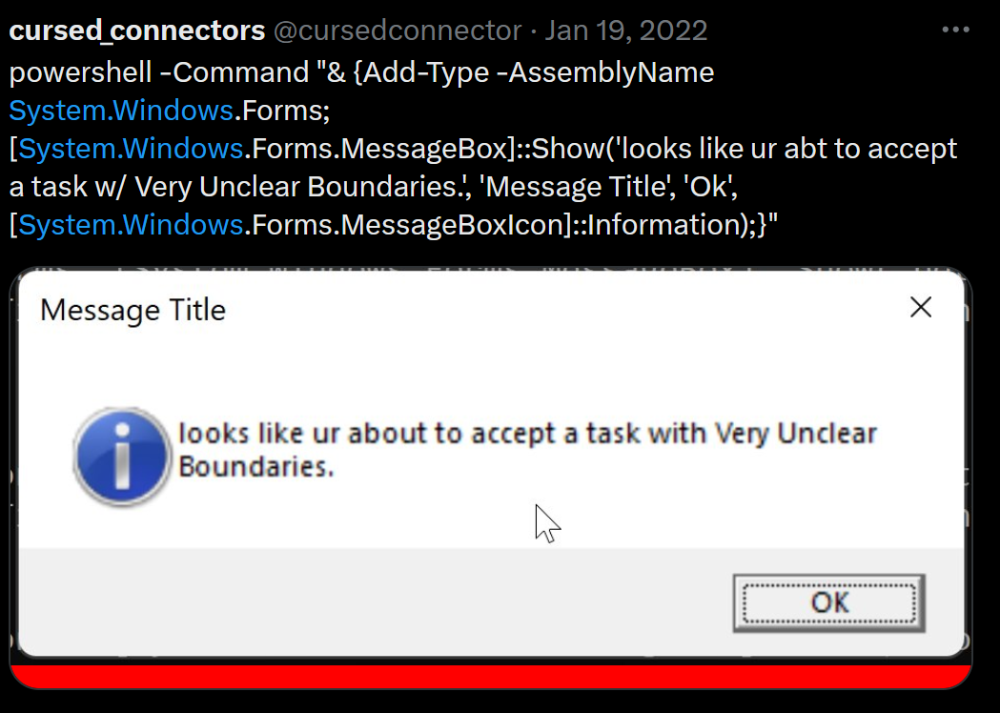

# Cursed Terrible Sketchy Pop Up Adventures

## Making pop-ups through powershell

Here's a [nice primer](https://4sysops.com/archives/how-to-display-a-pop-up-message-box-with-powershell/) on how to make them. We then set it up as a batch script, after fighting with parenthesis args and getting tips from [here](https://poshoholic.com/2007/09/27/invoking-a-powershell-script-from-cmdexe-or-start-run/).

If your batch script wrapper isn't working, don't forget to put a PAUSE on the last line so you can actually read your output.

## Wrapping a batch file as an exe to hide the content
So no one can peek at the content, let's wrap the batch file as an exe. This method was taken from [here](https://superuser.com/a/868341). And I've copied the instructions below in case the internet explodes.

In your C:\Windows\System32\ folder, there is a file called iexpress.exe.

1. Right-click it an Run as administrator.
2. Create a new SED and select "Extract files and run an installation command."
3. Add the script you want, and make sure that on the next screen, you set the install program to cmd /c [your_script.bat] where [your_script.bat] is the script file you want to execute. If you don't do this, windows will try to use Command.com (the old version of Command Prompt) which hasn't been in use for quite a while.
4. Select preferences (you might need to select "Store files using Long File Name inside Package), set an output path (to the .exe file you want to create), and select "No restart".
5. Click next and you should have your .exe!

Just a note, this file actually only acts as a wrapper for your script, and the script itself actually gets executed in a temp folder created on execution (and deleted afterwards), so make sure you don't use any relative paths.